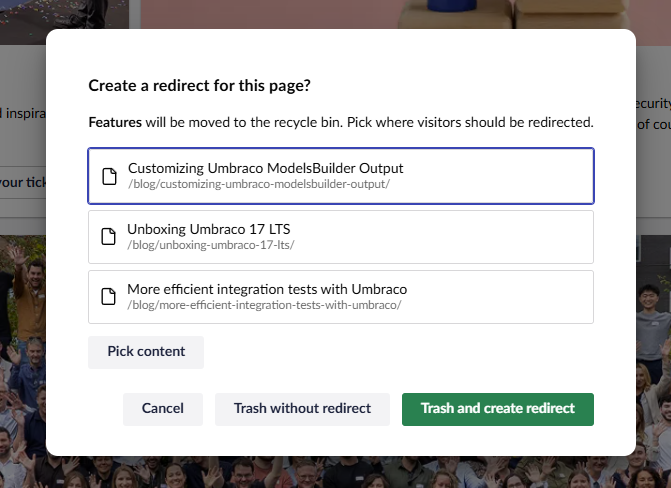
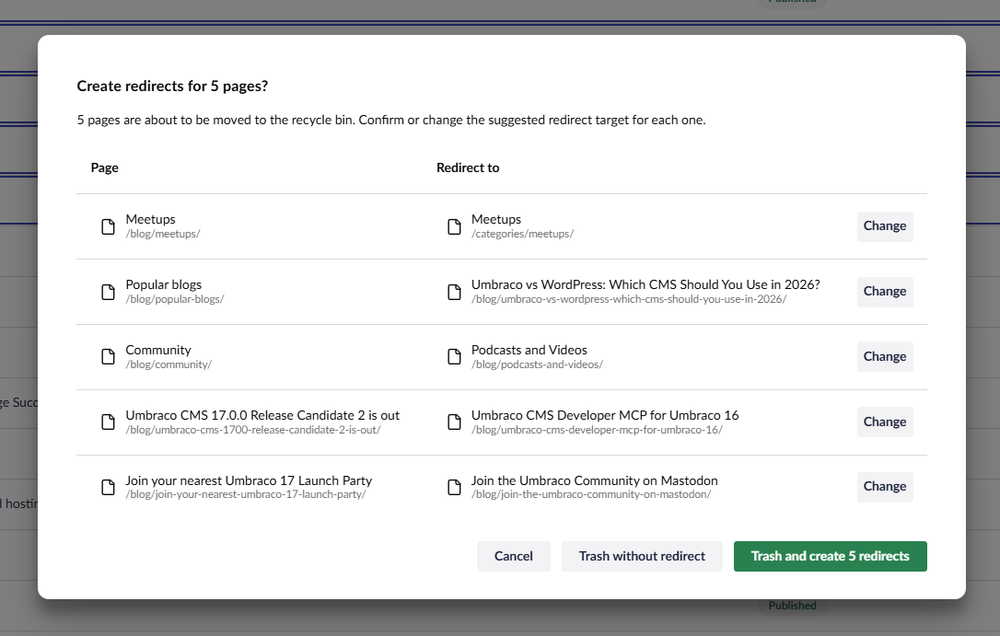
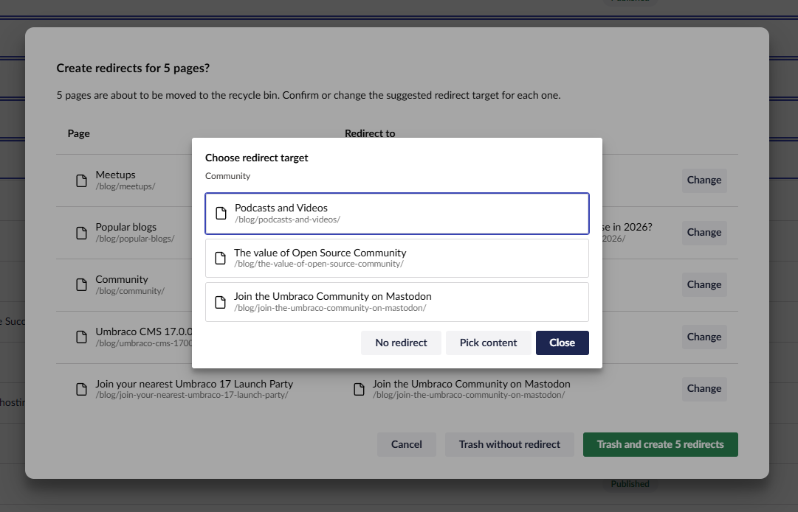
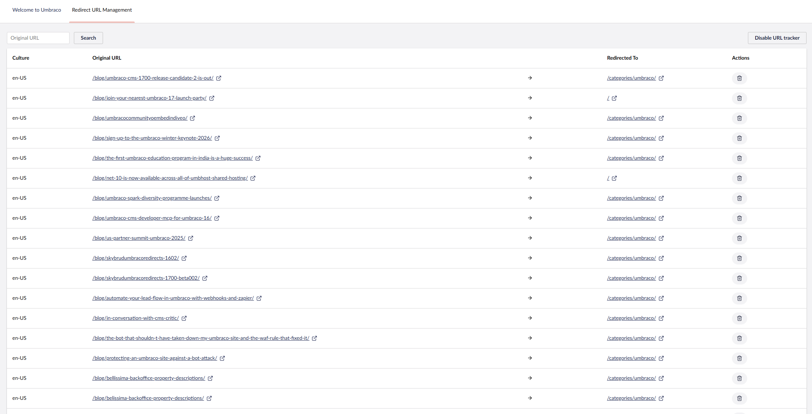

# Smart Redirect Suggester

Smart Redirect Suggester is an Umbraco package that helps you suggest redirect targets when content is moved to the recycle bin.

It captures the URLs of the pages being trashed, queries the best available published-content searcher for similar pages, and returns candidate redirect targets that can be reviewed before redirects are created.

## Screenshots

### Single item trash flow



### Bulk trash with suggested redirects



### Change a redirect target inside a bulk action



### Review redirects in Umbraco redirect management



## Project structure

- `src/Umbraco.Community.SmartRedirectSuggester`
  - The package project.
  - Contains the API controllers, services, models, composers, and client assets.
- `src/Umbraco.Community.SmartRedirectSuggester.Demo`
  - A local Umbraco test site used to run and verify the package in a real backoffice.
- `src/Umbraco.Community.SmartRedirectSuggester/README.md`
  - The NuGet package readme.

## Requirements

- .NET 10 SDK
- Node.js 20.17.0 or newer
- An Umbraco 17-compatible environment for local testing

## Package dependencies for consumers

When installing Smart Redirect Suggester in your own Umbraco site, you also need to install the search packages used to produce redirect suggestions.

Required:

```bash
dotnet add package Umbraco.Cms.Search
```

Optional, for AI-powered suggestions:

```bash
dotnet add package Umbraco.AI.Search
```

`Umbraco.Cms.Search` provides the published-content search integration used for fallback suggestions. `Umbraco.AI.Search` is optional and enables the preferred `UmbAI_Search` searcher when installed and configured.

## Running the package locally

### 1. Restore and build

From the repository root:

```bash
dotnet restore src/SmartRedirectSuggester.slnx
dotnet build src/SmartRedirectSuggester.slnx
```

### 2. Build the client assets

From `src/Umbraco.Community.SmartRedirectSuggester/Client`:

```bash
npm install
npm run build
```

For local frontend development, use:

```bash
npm run watch
```

The built client assets are copied into the package static web assets used by the test site.

### 3. Run the test site

From `src/Umbraco.Community.SmartRedirectSuggester.Demo`:

```bash
dotnet run
```

The local test site is configured to run on:

- `https://localhost:44334`
- `http://localhost:16442`

## How it works

- Before content is trashed, the package gathers the current published URLs for the selected documents.
- It expands the selection to include published descendants so nested content is handled in one operation.
- It first queries the `UmbAI_Search` searcher when `Umbraco.AI.Search` is installed.
- If `UmbAI_Search` is unavailable, it falls back to the `Umb_Content` published content searcher.
- It excludes the trashed content itself from the candidate list.
- When the action is confirmed, it registers redirects from the old routes to the selected target documents.

## Development notes

- The main redirect suggestion logic lives in `src/Umbraco.Community.SmartRedirectSuggester/Services/SmartRedirectSuggesterService.cs`.
- The prepare endpoint lives in `src/Umbraco.Community.SmartRedirectSuggester/Controllers/PrepareController.cs`.
- The package is designed to degrade gracefully when no supported searcher is available, returning no suggestions instead of failing startup.

## Packaging

The package metadata is defined in `src/Umbraco.Community.SmartRedirectSuggester/Umbraco.Community.SmartRedirectSuggester.csproj`.

NuGet packaging includes `src/Umbraco.Community.SmartRedirectSuggester/README.md` as the package readme.

Marketplace metadata is defined in `umbraco-marketplace.json`.

## Documentation

- [Documentation overview](docs/README.md)
- [Installation and configuration](docs/installation.md)
- [Development notes](docs/development.md)

## Contributing

Contributions are welcome.

If you make changes to the client code, rebuild the client assets before testing or packaging the project.
